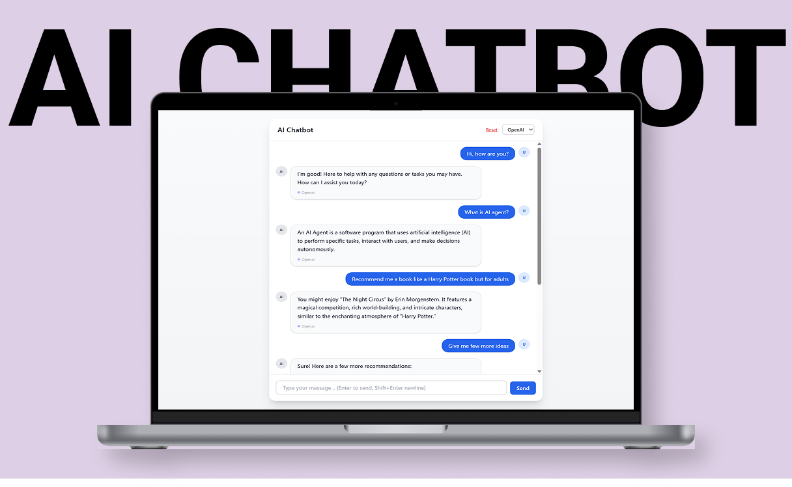

# Django AI Chatbot (OpenAI & Ollama) 

A simple chatbot web app built with **Django** + **Tailwind CSS**.  
Supports both **OpenAI (cloud)** and **Ollama (local)** providers.  
Users can ask questions in a chat-like interface with session-based memory.

<p align="left">
  <a href="https://django-ai-chatbot.onrender.com/"></a>
  
  
</p>

---

## 🖼️ Preview


|  | 


## 🚀 Features
- Django backend + Tailwind frontend
- Chat UI with user + assistant bubbles
- Provider switch (OpenAI ↔ Ollama)
- Session-based conversation history
- Reset chat anytime

## 🛠 Tech Stack
- Python 3.13
- Django 5
- Tailwind CSS
- OpenAI API / Ollama local models

## ⚙️ Setup
```bash
git clone https://github.com/AnnaBilokon/django-ai-chatbot.git
cd django-ai-chatbot

# Create virtual environment
python -m venv .venv
source .venv/bin/activate   # Linux/macOS
.venv\Scripts\activate      # Windows

# Install deps
pip install -r requirements.txt

# Run migrations
python manage.py migrate

# Start server
python manage.py runserver
